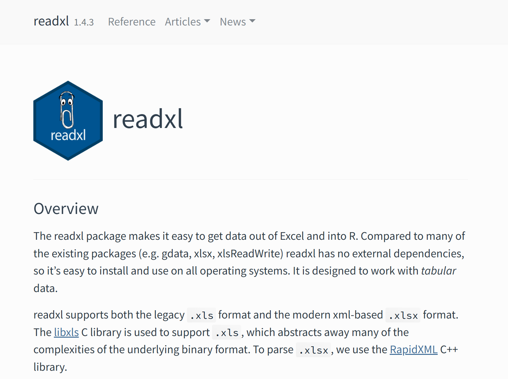
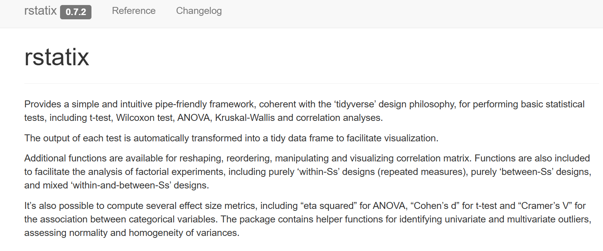
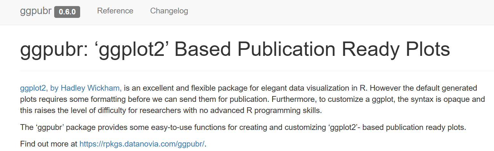
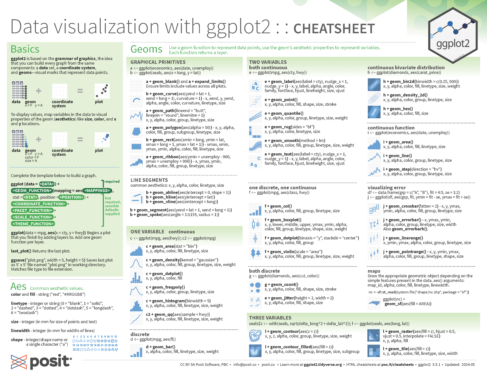
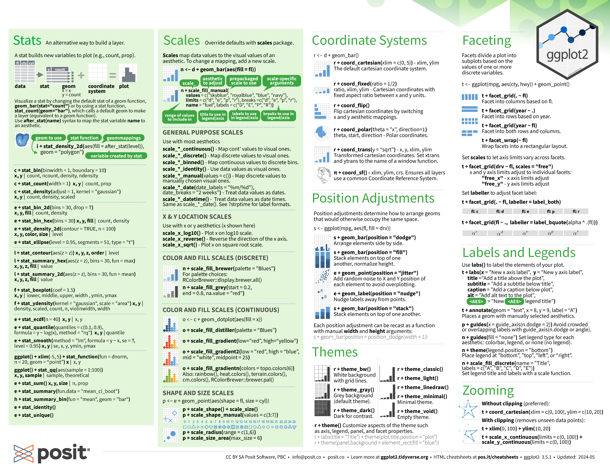

Chapter 1: Introduction to R and RStudio
================

## Installing R

You can download R from the: [The Comprehensive R Archive
Network](https://cran.r-project.org/).

Be sure to select the appropriate download link for your operating
system.


If you are using Windows, click **Download R for Windows**, then select
**base** or **install R for the first time** to proceed with the
installation.


Finally, click **Download** to start the installation.


## Installing RStudio

After installing R, download RStudio from the following link: [RStudio
Desktop](https://posit.co/download/rstudio-desktop/).

Click **DOWNLOAD RSTUDIO DESKTOP FOR WINDOWS**, or select the
appropriate version from the list based on your operating system.


## Commonly Used Packages

### [**Tidyverse**](https://www.tidyverse.org/)

The Tidyverse is **a collection of essential R packages** designed for
data analysis, visualization, and manipulation. It provides a consistent
and efficient workflow for working with data in R.


### [**readxl**](https://readxl.tidyverse.org/index.html)

The readxl package is used to **import Excel files** (`.xls` and
`.xlsx`) into R, allowing for easy data extraction and manipulation.



### [**writexl**](https://cran.r-project.org/web/packages/writexl/index.html)

The writexl package is used to **export data from R to Excel** (`.xlsx`)
format, providing a simple and dependency-free way to write data frames
to Excel files.

### [**showtext**](https://cran.rstudio.com/web/packages/showtext/vignettes/introduction.html)

The showtext package is used to **adjust and customize fonts** in R
plots. It allows you to use various fonts, including system and web
fonts, to enhance the appearance of text in your figures.


### [**rstatix**](https://rpkgs.datanovia.com/rstatix/)

The rstatix package provides a simple and consistent interface for
performing **basic statistical tests** in R. It includes functions for
hypothesis testing, data summarization, and statistical analysis, making
it easier to conduct common tests like t-tests, ANOVA, and correlation
analyses.



### [**ggpubr**](https://rpkgs.datanovia.com/ggpubr/)

The ggpubr package is designed for creating publication-ready
**statistical plots** in R. It extends ggplot2 with additional functions
for adding statistical annotations, customizing plot themes, and
improving the presentation of data visualizations.



### [**ComplexHeatmap**](https://jokergoo.github.io/ComplexHeatmap-reference/book/)

The ComplexHeatmap package is used to create both **simple and complex
heatmaps** in R, as well as other high-level visualizations. It provides
advanced features for customizing heatmaps and integrating multiple data
layers, making it a powerful tool for visualizing complex datasets.


## Learning Resources

### 1. Reference Books

[**R for Data Science (2e)**](https://r4ds.hadley.nz/)

> This book will teach you how to do data science with R: You’ll learn
> how to get your data into R, get it into the most useful structure,
> transform it and visualize.

[**R Cookbook, 2nd Edition**](https://rc2e.com/)

> This book is full of how-to recipes, each of which solves a specific
> problem. The recipe includes a quick introduction to the solution
> followed by a discussion that aims to unpack the solution and give you
> some insight into how it works. We know these recipes are useful and
> we know they work, because we use them ourselves.

[**ggplot2: Elegant Graphics for Data Analysis
(3e)**](https://ggplot2-book.org/)

> While this book gives some details on the basics of ggplot2, its
> primary focus is explaining the Grammar of Graphics that ggplot2 uses,
> and describing the full details.

[**Advanced R, 2nd Edition**](https://adv-r.hadley.nz/)

> The book is designed primarily for R users who want to improve their
> programming skills and understanding of the language. It should also
> be useful for programmers coming to R from other languages, as help
> you to understand why R works the way it does.

### 2. Cheatsheets

R and RStudio are supported by a vibrant community dedicated to making
the R language more powerful and accessible. The community has
contributed a variety of well-designed cheatsheets for R, RStudio, and R
packages. You can access the [base R
cheat-sheet](https://iqss.github.io/dss-workshops/R/Rintro/base-r-cheat-sheet.pdf)
and explore all [Posit
Cheatsheets](https://posit.co/resources/cheatsheets/) for quick
references and tips.


For example, you can refer to the **ggplot2 cheatsheet**, which provides
a quick reference for creating various types of plots using the ggplot2
package in R. This cheat sheet covers essential functions, customization
options, and common plot types.




### 3. REDNote (or Other Social Media Platforms like YouTube or Bilibili)

You can also explore resources on REDNote, which is designed for
learning R in a short amount of time. While it may provide quick
insights, it is generally not recommended as a primary learning resource
due to its focus on speed over in-depth understanding.


## Two Examples Demonstrating the Use of Package Functions in Proteomic Data Analysis

### 1. Kolmogorov–Smirnov test

The Kolmogorov-Smirnov (K-S) test is a non-parametric statistical test
used to compare two distributions and assess whether they differ
significantly. It measures the maximum absolute difference between their
cumulative distribution functions (CDFs).

In proteomics, the K-S test is often used to compare the physicochemical
properties of two groups of proteins (e.g., the isoelectric points of
upregulated vs. downregulated proteins) or to compare fold changes
across different protein categories (e.g., RNA-binding vs. non
RNA-binding proteins). However, challenges arise when the data is not
tidy or when comparing the distributions of multiple protein groups.

For instance, in an experiment involving newly synthesized proteins, we
may want to investigate the effect of inhibitors (such as Btz and 3MA)
on the abundance of newly synthesized proteins across different
sub-cellular compartments.

You can get access **training data 1** for this example using the
following link: [training data
1](https://github.com/lfu46/Glycoproteomic-Data-Analysis-using-R-and-Pyton/blob/main/Chapter1/training_data_1.xlsx)

Here is how you would read in the data and take a quick look at it:

``` r
#import packages
packages_names <- c('tidyverse', 'readxl', 'writexl')
lapply(packages_names, require, character.only = TRUE)
```

    ## Loading required package: tidyverse

    ## Warning: package 'lubridate' was built under R version 4.4.1

    ## ── Attaching core tidyverse packages ──────────────────────── tidyverse 2.0.0 ──
    ## ✔ dplyr     1.1.4     ✔ readr     2.1.5
    ## ✔ forcats   1.0.0     ✔ stringr   1.5.1
    ## ✔ ggplot2   3.5.1     ✔ tibble    3.2.1
    ## ✔ lubridate 1.9.4     ✔ tidyr     1.3.1
    ## ✔ purrr     1.0.2

    ## ── Conflicts ────────────────────────────────────────── tidyverse_conflicts() ──
    ## ✖ dplyr::filter() masks stats::filter()
    ## ✖ dplyr::lag()    masks stats::lag()
    ## ℹ Use the conflicted package (<http://conflicted.r-lib.org/>) to force all conflicts to become errors
    ## Loading required package: readxl
    ## 
    ## Loading required package: writexl

    ## Warning: package 'writexl' was built under R version 4.4.1

    ## [[1]]
    ## [1] TRUE
    ## 
    ## [[2]]
    ## [1] TRUE
    ## 
    ## [[3]]
    ## [1] TRUE

``` r
#load training data 1
training_data_1 <- read_xlsx(
  'training_data_1.xlsx'
)

#have a quick look at the data
head(training_data_1, n = 10)
```

    ## # A tibble: 10 × 33
    ##    Gene    Btz1   Btz2  X3MA1  X3MA2  Comb1  Comb2  DMSO1  DMSO2 Avg_Btz Avg_3MA
    ##    <chr>  <dbl>  <dbl>  <dbl>  <dbl>  <dbl>  <dbl>  <dbl>  <dbl>   <dbl>   <dbl>
    ##  1 AAK1  3.71e6 3.32e6 2.87e6 3.01e6 2.51e6 2.77e6 4.90e6 4.54e6  3.51e6  2.94e6
    ##  2 AAR2  6.74e6 6.82e6 3.97e6 4.54e6 4.82e6 4.61e6 1.08e7 1.08e7  6.78e6  4.26e6
    ##  3 AARS1 2.15e8 2.03e8 1.36e8 1.33e8 1.25e8 1.40e8 2.62e8 2.52e8  2.09e8  1.35e8
    ##  4 AARS2 6.00e6 5.92e6 4.36e6 5.05e6 4.23e6 4.21e6 7.41e6 6.60e6  5.96e6  4.71e6
    ##  5 AASDH 4.03e5 3.55e5 2.60e5 2.41e5 2.77e5 2.90e5 4.54e5 5.34e5  3.79e5  2.50e5
    ##  6 ABCA1 1.75e7 1.56e7 1.04e7 1.16e7 1.91e7 1.72e7 9.64e6 1.04e7  1.65e7  1.10e7
    ##  7 ABCA2 5.91e6 5.78e6 3.45e6 3.76e6 5.18e6 5.64e6 4.68e6 4.70e6  5.85e6  3.60e6
    ##  8 ABCA5 1.02e6 9.47e5 7.79e5 8.31e5 8.47e5 9.44e5 9.96e5 1.05e6  9.82e5  8.05e5
    ##  9 ABCB… 3.22e7 3.24e7 1.98e7 1.94e7 2.32e7 2.46e7 2.78e7 2.87e7  3.23e7  1.96e7
    ## 10 ABCC1 5.45e6 5.24e6 3.28e6 3.47e6 3.70e6 3.81e6 5.00e6 4.91e6  5.35e6  3.37e6
    ## # ℹ 22 more variables: Avg_Comb <dbl>, Avg_DMSO <dbl>, `Btz/DMSO` <dbl>,
    ## #   `3MA/DMSO` <dbl>, `Comb/DMSO` <dbl>, `plasma membrane [GO:0005886]` <dbl>,
    ## #   `cytosol [GO:0005829]` <dbl>, `extracellular exosome [GO:0070062]` <dbl>,
    ## #   `mitochondrion [GO:0005739]` <dbl>, `endosome [GO:0005768]` <dbl>,
    ## #   `Golgi apparatus [GO:0005794]` <dbl>, `lysosome [GO:0005764]` <dbl>,
    ## #   `nucleolus [GO:0005730]` <dbl>, `nucleoplasm [GO:0005654]` <dbl>,
    ## #   `endoplasmic reticulum [GO:0005783]` <dbl>, …

The dataset contains 33 columns, including `Gene Name`, `Fold Change`
and `GO Terms`, but the structure is inconsistent and unsuitable for
further analysis. To prepare the data for statistical tests, we need to
reshape it into a [tidy
format](https://r4ds.hadley.nz/data-tidy.html#sec-tidy-data), where each
variable is stored in its own column and each observation is a row. This
allows us to apply various data manipulation and statistical functions
effectively.

In this case, we’ll reshape the data and clean up the column names
(especially removing slashes in `Btz/DMSO`, `3MA/DMSO` and `Comb/DMSO`).

``` r
training_data_1_adj <- training_data_1 |> 
  select(Gene, `Btz/DMSO`:`vacuole [GO:0005773]`) |> 
  pivot_longer(cols = `plasma membrane [GO:0005886]`:`vacuole [GO:0005773]`, names_to = 'GO_Term', values_to = 'value') |> 
  filter(value == 1) |> 
  select(Gene, Btz_DMSO = `Btz/DMSO`, `3MA_DMSO` = `3MA/DMSO`, Comb_DMSO = `Comb/DMSO`, GO_Term) |> 
  pivot_longer(cols = Btz_DMSO:Comb_DMSO, names_to = 'Exp', values_to = 'Fold_Change')

#let us look at the adjusted data
head(training_data_1_adj, n = 10)
```

    ## # A tibble: 10 × 4
    ##    Gene  GO_Term                           Exp       Fold_Change
    ##    <chr> <chr>                             <chr>           <dbl>
    ##  1 AAK1  plasma membrane [GO:0005886]      Btz_DMSO        0.744
    ##  2 AAK1  plasma membrane [GO:0005886]      3MA_DMSO        0.622
    ##  3 AAK1  plasma membrane [GO:0005886]      Comb_DMSO       0.559
    ##  4 AAK1  cytosol [GO:0005829]              Btz_DMSO        0.744
    ##  5 AAK1  cytosol [GO:0005829]              3MA_DMSO        0.622
    ##  6 AAK1  cytosol [GO:0005829]              Comb_DMSO       0.559
    ##  7 AAR2  spliceosomal complex [GO:0005681] Btz_DMSO        0.627
    ##  8 AAR2  spliceosomal complex [GO:0005681] 3MA_DMSO        0.393
    ##  9 AAR2  spliceosomal complex [GO:0005681] Comb_DMSO       0.436
    ## 10 AARS1 cytosol [GO:0005829]              Btz_DMSO        0.811

The adjusted data looks much better in a tidy way. Now we can define a
function to perform the Kolmogorov-Smirnov (K-S) test for each
sub-cellular compartment (i.e., for each GO term). The function will
compare the fold changes across the three conditions (`Btz_DMSO`,
`3MA_DMSO`, and `Comb_DMSO`).

``` r
ks_test_function <- function(df){
  #get all possible combination of experimental conditions
  Exp_list <- unique(df$Exp)
  combs <- data.frame(combn(Exp_list, 2, simplify = TRUE))
  
  #generate result tibble
  tibble(
    GO_term_list = unique(df$GO_Term),
    comparison = map(combs, \(x) paste(x, collapse = " vs ")),
    p_value = map(combs, \(x) ks.test(
      df |> filter(Exp == x[1]) |> pull(Fold_Change),
      df |> filter(Exp == x[2]) |> pull(Fold_Change)
        )$p.value
      )
    )
}
```

Then we can apply the function to our data.

``` r
comparison_p_value_df <- training_data_1_adj |> 
  group_by(GO_Term) |> 
  group_split() |> 
  #map_df applies the ks_test_function to each data frame in the list generated by group_split()
  map_df(ks_test_function) |> 
  unnest_longer(c(comparison, p_value))

#let us check the result
head(comparison_p_value_df, n = 20)
```

    ## # A tibble: 20 × 3
    ##    GO_term_list                       comparison              p_value
    ##    <chr>                              <chr>                     <dbl>
    ##  1 Golgi apparatus [GO:0005794]       Btz_DMSO vs 3MA_DMSO  1.71e- 47
    ##  2 Golgi apparatus [GO:0005794]       Btz_DMSO vs Comb_DMSO 3.73e- 39
    ##  3 Golgi apparatus [GO:0005794]       3MA_DMSO vs Comb_DMSO 6.63e-  3
    ##  4 centrosome [GO:0005813]            Btz_DMSO vs 3MA_DMSO  2.78e- 52
    ##  5 centrosome [GO:0005813]            Btz_DMSO vs Comb_DMSO 7.92e- 43
    ##  6 centrosome [GO:0005813]            3MA_DMSO vs Comb_DMSO 2.04e-  1
    ##  7 cytoskeleton [GO:0005856]          Btz_DMSO vs 3MA_DMSO  2.83e- 16
    ##  8 cytoskeleton [GO:0005856]          Btz_DMSO vs Comb_DMSO 2.83e- 16
    ##  9 cytoskeleton [GO:0005856]          3MA_DMSO vs Comb_DMSO 7.09e-  1
    ## 10 cytosol [GO:0005829]               Btz_DMSO vs 3MA_DMSO  2.96e-275
    ## 11 cytosol [GO:0005829]               Btz_DMSO vs Comb_DMSO 1.09e-264
    ## 12 cytosol [GO:0005829]               3MA_DMSO vs Comb_DMSO 3.97e-  5
    ## 13 endoplasmic reticulum [GO:0005783] Btz_DMSO vs 3MA_DMSO  1.64e- 32
    ## 14 endoplasmic reticulum [GO:0005783] Btz_DMSO vs Comb_DMSO 1.76e- 28
    ## 15 endoplasmic reticulum [GO:0005783] 3MA_DMSO vs Comb_DMSO 4.40e-  2
    ## 16 endosome [GO:0005768]              Btz_DMSO vs 3MA_DMSO  2.29e- 17
    ## 17 endosome [GO:0005768]              Btz_DMSO vs Comb_DMSO 8.00e- 15
    ## 18 endosome [GO:0005768]              3MA_DMSO vs Comb_DMSO 2.34e-  1
    ## 19 extracellular exosome [GO:0070062] Btz_DMSO vs 3MA_DMSO  2.16e- 67
    ## 20 extracellular exosome [GO:0070062] Btz_DMSO vs Comb_DMSO 8.37e- 85

The results are well-organized and logical, with one column for
`GO terms`, one for `comparisons`, and another for `p-values` from the
KS test. We can visualize these results in a heatmap to better interpret
the statistical differences between conditions across the various GO
terms.

``` r
#import ComplexHeatmap
library(ComplexHeatmap)
```

    ## Warning: package 'ComplexHeatmap' was built under R version 4.4.1

    ## Loading required package: grid

    ## ========================================
    ## ComplexHeatmap version 2.22.0
    ## Bioconductor page: http://bioconductor.org/packages/ComplexHeatmap/
    ## Github page: https://github.com/jokergoo/ComplexHeatmap
    ## Documentation: http://jokergoo.github.io/ComplexHeatmap-reference
    ## 
    ## If you use it in published research, please cite either one:
    ## - Gu, Z. Complex Heatmap Visualization. iMeta 2022.
    ## - Gu, Z. Complex heatmaps reveal patterns and correlations in multidimensional 
    ##     genomic data. Bioinformatics 2016.
    ## 
    ## 
    ## The new InteractiveComplexHeatmap package can directly export static 
    ## complex heatmaps into an interactive Shiny app with zero effort. Have a try!
    ## 
    ## This message can be suppressed by:
    ##   suppressPackageStartupMessages(library(ComplexHeatmap))
    ## ========================================

``` r
#change the format of our data
heatmap_comparison_p_value <- comparison_p_value_df |> 
  mutate(log_p_value = -log10(p_value)) |> 
  select(GO_term_list, comparison, log_p_value) |> 
  pivot_wider(names_from = comparison, values_from = log_p_value)

#check
head(heatmap_comparison_p_value, n = 10)
```

    ## # A tibble: 10 × 4
    ##    GO_term_list                    `Btz_DMSO vs 3MA_DMSO` Btz_DMSO vs Comb_DMS…¹
    ##    <chr>                                            <dbl>                  <dbl>
    ##  1 Golgi apparatus [GO:0005794]                      46.8                   38.4
    ##  2 centrosome [GO:0005813]                           51.6                   42.1
    ##  3 cytoskeleton [GO:0005856]                         15.5                   15.5
    ##  4 cytosol [GO:0005829]                             275.                   264. 
    ##  5 endoplasmic reticulum [GO:0005…                   31.8                   27.8
    ##  6 endosome [GO:0005768]                             16.6                   14.1
    ##  7 extracellular exosome [GO:0070…                   66.7                   84.1
    ##  8 lysosome [GO:0005764]                             11.3                   11.8
    ##  9 mitochondrion [GO:0005739]                        48.3                   79.0
    ## 10 nucleolus [GO:0005730]                            53.0                   54.0
    ## # ℹ abbreviated name: ¹​`Btz_DMSO vs Comb_DMSO`
    ## # ℹ 1 more variable: `3MA_DMSO vs Comb_DMSO` <dbl>

``` r
#generate data matrix
heatmap_matrix <- data.matrix(heatmap_comparison_p_value |> select(!GO_term_list))
rownames(heatmap_matrix) <- heatmap_comparison_p_value$GO_term_list

#check
heatmap_matrix
```

    ##                                    Btz_DMSO vs 3MA_DMSO Btz_DMSO vs Comb_DMSO
    ## Golgi apparatus [GO:0005794]                  46.767216             38.428481
    ## centrosome [GO:0005813]                       51.556079             42.101370
    ## cytoskeleton [GO:0005856]                     15.548953             15.548953
    ## cytosol [GO:0005829]                         274.528699            263.963737
    ## endoplasmic reticulum [GO:0005783]            31.785350             27.753582
    ## endosome [GO:0005768]                         16.640591             14.096866
    ## extracellular exosome [GO:0070062]            66.664570             84.077115
    ## lysosome [GO:0005764]                         11.289984             11.795134
    ## mitochondrion [GO:0005739]                    48.303107             78.972608
    ## nucleolus [GO:0005730]                        53.048851             54.023257
    ## nucleoplasm [GO:0005654]                     234.737112            220.306344
    ## peroxisome [GO:0005777]                        3.383494              4.354442
    ## plasma membrane [GO:0005886]                  83.209565             92.629427
    ## proteasome complex [GO:0000502]               14.267960              3.952277
    ## ribosome [GO:0005840]                          4.819716              4.819716
    ## spliceosomal complex [GO:0005681]              7.806242              8.752996
    ## vacuole [GO:0005773]                           1.544068              1.544068
    ##                                    3MA_DMSO vs Comb_DMSO
    ## Golgi apparatus [GO:0005794]                  2.17824337
    ## centrosome [GO:0005813]                       0.69126443
    ## cytoskeleton [GO:0005856]                     0.14934600
    ## cytosol [GO:0005829]                          4.40105424
    ## endoplasmic reticulum [GO:0005783]            1.35632897
    ## endosome [GO:0005768]                         0.63030287
    ## extracellular exosome [GO:0070062]            6.63952850
    ## lysosome [GO:0005764]                         0.47997098
    ## mitochondrion [GO:0005739]                    9.53252593
    ## nucleolus [GO:0005730]                        2.03137392
    ## nucleoplasm [GO:0005654]                      3.60406471
    ## peroxisome [GO:0005777]                       0.00904699
    ## plasma membrane [GO:0005886]                  3.05535759
    ## proteasome complex [GO:0000502]               3.11649409
    ## ribosome [GO:0005840]                         0.91059098
    ## spliceosomal complex [GO:0005681]             0.39175264
    ## vacuole [GO:0005773]                          0.11270428

``` r
#plot the heatmap
Heatmap(heatmap_matrix, name = '-log10_p_value', color = heatmap_color)
```

<!-- -->

The figure may not look optimal because we haven’t fine-tuned the
parameters. You can find all available parameters in the [ComplexHeatmap
Complete
Reference](https://jokergoo.github.io/ComplexHeatmap-reference/book/).
However, our focus now is on: What insights can we gain from this
heatmap?

### 2. Violin boxplot

Next, we will use the data from `cytosol [GO:0005829]` to create a
violin plot with boxplot overlays.

``` r
#import packages
packages_names <- c('showtext', 'rstatix', 'ggpubr')
lapply(packages_names, require, character.only = TRUE)
```

    ## Loading required package: showtext

    ## Loading required package: sysfonts

    ## Loading required package: showtextdb

    ## Loading required package: rstatix

    ## 
    ## Attaching package: 'rstatix'

    ## The following object is masked from 'package:stats':
    ## 
    ##     filter

    ## Loading required package: ggpubr

    ## [[1]]
    ## [1] TRUE
    ## 
    ## [[2]]
    ## [1] TRUE
    ## 
    ## [[3]]
    ## [1] TRUE

``` r
#statistical test
cytosol_wilcox_test <- training_data_1_adj |> 
  filter(GO_Term == 'cytosol [GO:0005829]') |> 
  #The Wilcoxon test is performed to compare the Fold Change between different experimental conditions (Exp) with Benianmini-Hochberg correction.
  wilcox_test(Fold_Change ~ Exp, p.adjust.method = 'BH')

#check
cytosol_wilcox_test
```

    ## # A tibble: 3 × 9
    ##   .y.       group1 group2    n1    n2 statistic         p     p.adj p.adj.signif
    ## * <chr>     <chr>  <chr>  <int> <int>     <dbl>     <dbl>     <dbl> <chr>       
    ## 1 Fold_Cha… 3MA_D… Btz_D…  2219  2219    814070 0         0         ****        
    ## 2 Fold_Cha… 3MA_D… Comb_…  2219  2219   2545358 5.1 e-  2 5.1 e-  2 ns          
    ## 3 Fold_Cha… Btz_D… Comb_…  2219  2219   3978971 1.01e-276 1.52e-276 ****

``` r
#violin boxplot
#The showtext package is used to load and use the Arial font (or any custom font). This ensures the font is displayed correctly in the plot.
font_add(family = 'arial', regular = 'arial.ttf')
#showtext_auto() enables the automatic use of this font in the plot rendering.
showtext_auto()

violin_boxplot_cytosol <- training_data_1_adj |> 
  filter(GO_Term == 'cytosol [GO:0005829]') |> 
  ggplot() +
  geom_violin(
    aes(x = Exp, y = Fold_Change), fill = '#4b1978', color = 'transparent'
  ) +
  geom_boxplot(
    aes(x = Exp, y = Fold_Change), width = 0.2, outliers = FALSE
  ) +
  #stat_pvalue_manual() overlays the p-value results from the Wilcoxon test on the plot, indicating statistical significance between the experimental conditions.
  stat_pvalue_manual(
    data = cytosol_wilcox_test, label = 'p.adj.signif', hide.ns = TRUE,
    tip.length = 0, y.position = c(1.8), label.size = 6
  ) +
  coord_cartesian(ylim = c(0, 2)) +
  labs(x = '', y = 'Fold Change') +
  #theme_bw() applies a clean black-and-white theme to the plot.
  theme_bw() +
  #theme() customizes various plot elements, such as grid lines and axis text properties (color, size, and angle of x-axis labels).
  theme(
    panel.grid.major = element_line(color = 'gray', linewidth = 0.2),
    panel.grid.minor = element_line(color = 'gray', linewidth = 0.1),
    axis.text.x = element_text(color = 'black', size = 9, angle = 30, hjust = 1),
    axis.text.y = element_text(color = 'black', size = 9)
  )

#display the plot
violin_boxplot_cytosol
```

<!-- -->

``` r
#save the plot as an EPS file
ggsave(
  filename = "violin_boxplot_cytosol.eps",
  device = 'eps',
  height = 2, width = 2, units = 'in'
)
```

### What have we learn

- How to reshape data from external sources (such as search engines or
  online tools) into a format suitable for statistical analysis and
  figure generation.
- How to use `ggplot2` to create a violin boxplot, fine-tune the plot
  with specific functions, and save the final figure in EPS format for
  publication or further use.

``` r
sessionInfo()
```

    ## R version 4.4.0 (2024-04-24)
    ## Platform: aarch64-apple-darwin20
    ## Running under: macOS Sonoma 14.6.1
    ## 
    ## Matrix products: default
    ## BLAS:   /Library/Frameworks/R.framework/Versions/4.4-arm64/Resources/lib/libRblas.0.dylib 
    ## LAPACK: /Library/Frameworks/R.framework/Versions/4.4-arm64/Resources/lib/libRlapack.dylib;  LAPACK version 3.12.0
    ## 
    ## locale:
    ## [1] en_US.UTF-8/en_US.UTF-8/en_US.UTF-8/C/en_US.UTF-8/en_US.UTF-8
    ## 
    ## time zone: America/New_York
    ## tzcode source: internal
    ## 
    ## attached base packages:
    ## [1] grid      stats     graphics  grDevices utils     datasets  methods  
    ## [8] base     
    ## 
    ## other attached packages:
    ##  [1] ggpubr_0.6.0          rstatix_0.7.2         showtext_0.9-7       
    ##  [4] showtextdb_3.0        sysfonts_0.8.9        ComplexHeatmap_2.22.0
    ##  [7] writexl_1.5.1         readxl_1.4.3          lubridate_1.9.4      
    ## [10] forcats_1.0.0         stringr_1.5.1         dplyr_1.1.4          
    ## [13] purrr_1.0.2           readr_2.1.5           tidyr_1.3.1          
    ## [16] tibble_3.2.1          ggplot2_3.5.1         tidyverse_2.0.0      
    ## 
    ## loaded via a namespace (and not attached):
    ##  [1] tidyselect_1.2.1    farver_2.1.2        fastmap_1.2.0      
    ##  [4] digest_0.6.37       timechange_0.3.0    lifecycle_1.0.4    
    ##  [7] cluster_2.1.8       magrittr_2.0.3      compiler_4.4.0     
    ## [10] rlang_1.1.4         tools_4.4.0         utf8_1.2.4         
    ## [13] yaml_2.3.10         knitr_1.49          ggsignif_0.6.4     
    ## [16] labeling_0.4.3      RColorBrewer_1.1-3  abind_1.4-8        
    ## [19] withr_3.0.2         BiocGenerics_0.52.0 stats4_4.4.0       
    ## [22] colorspace_2.1-1    scales_1.3.0        iterators_1.0.14   
    ## [25] cli_3.6.3           rmarkdown_2.29      crayon_1.5.3       
    ## [28] ragg_1.3.3          generics_0.1.3      rstudioapi_0.17.1  
    ## [31] tzdb_0.4.0          rjson_0.2.23        parallel_4.4.0     
    ## [34] cellranger_1.1.0    matrixStats_1.5.0   vctrs_0.6.5        
    ## [37] carData_3.0-5       car_3.1-3           IRanges_2.40.1     
    ## [40] hms_1.1.3           GetoptLong_1.0.5    S4Vectors_0.44.0   
    ## [43] Formula_1.2-5       clue_0.3-66         systemfonts_1.2.0  
    ## [46] foreach_1.5.2       glue_1.8.0          codetools_0.2-20   
    ## [49] stringi_1.8.4       shape_1.4.6.1       gtable_0.3.6       
    ## [52] munsell_0.5.1       pillar_1.10.1       htmltools_0.5.8.1  
    ## [55] circlize_0.4.16     R6_2.5.1            textshaping_0.4.1  
    ## [58] doParallel_1.0.17   evaluate_1.0.3      png_0.1-8          
    ## [61] backports_1.5.0     broom_1.0.7         xfun_0.50          
    ## [64] pkgconfig_2.0.3     GlobalOptions_0.1.2
