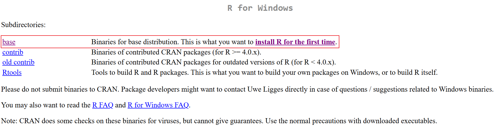
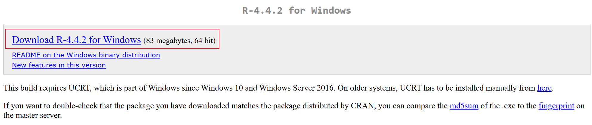
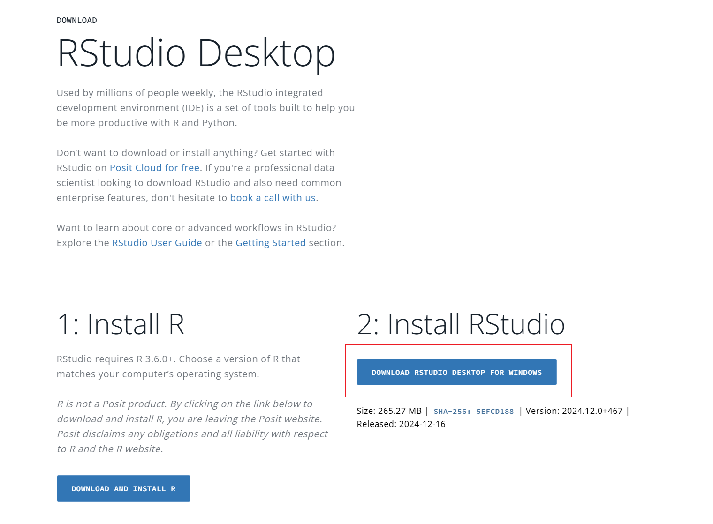
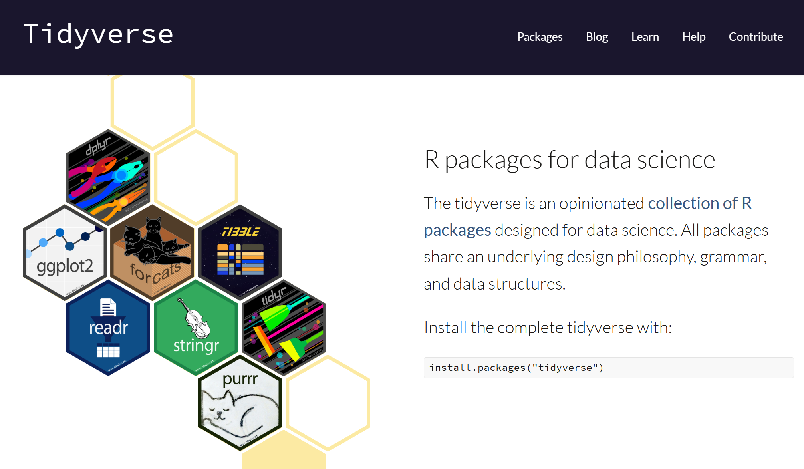
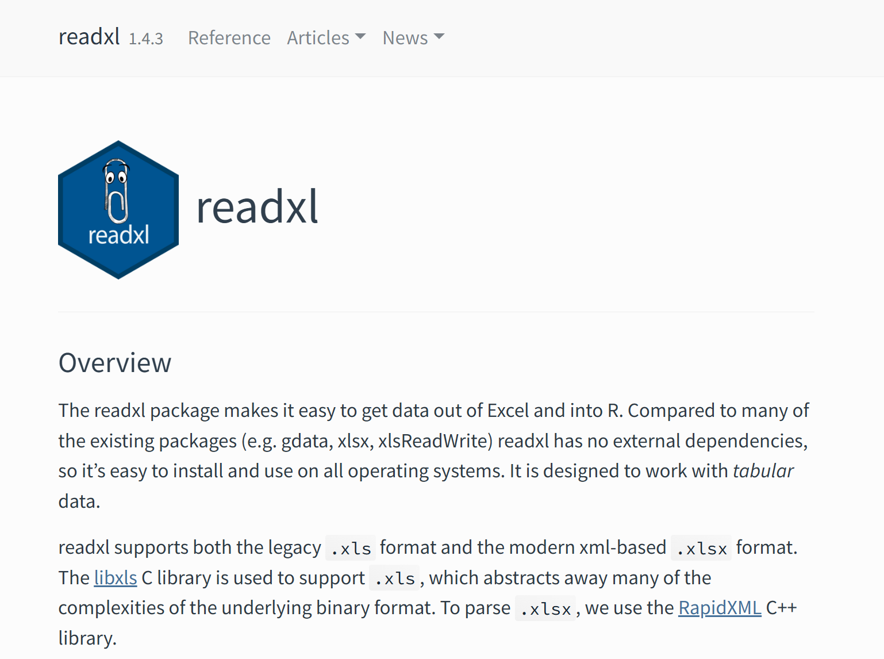
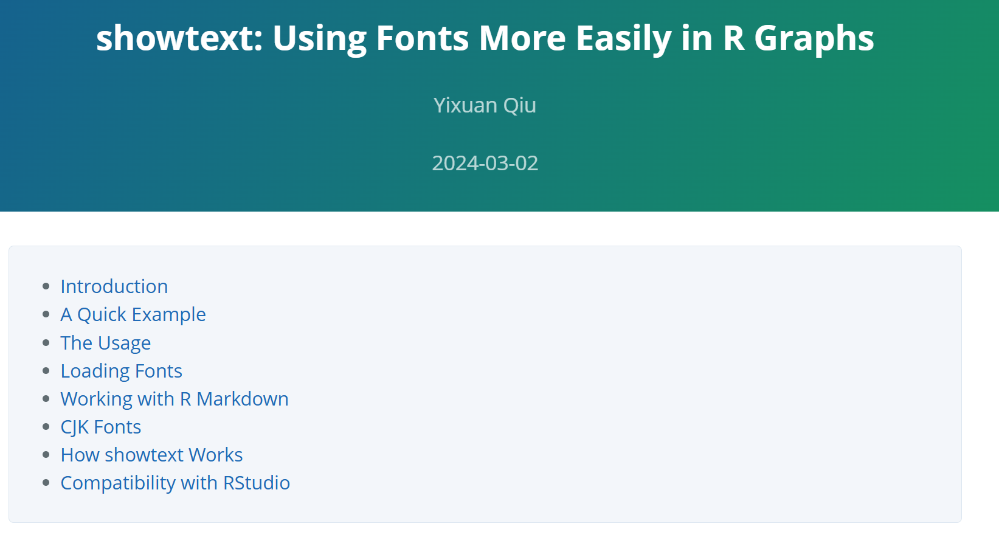
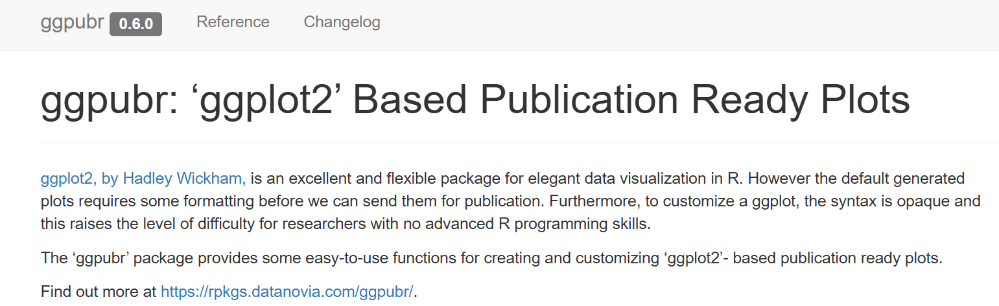
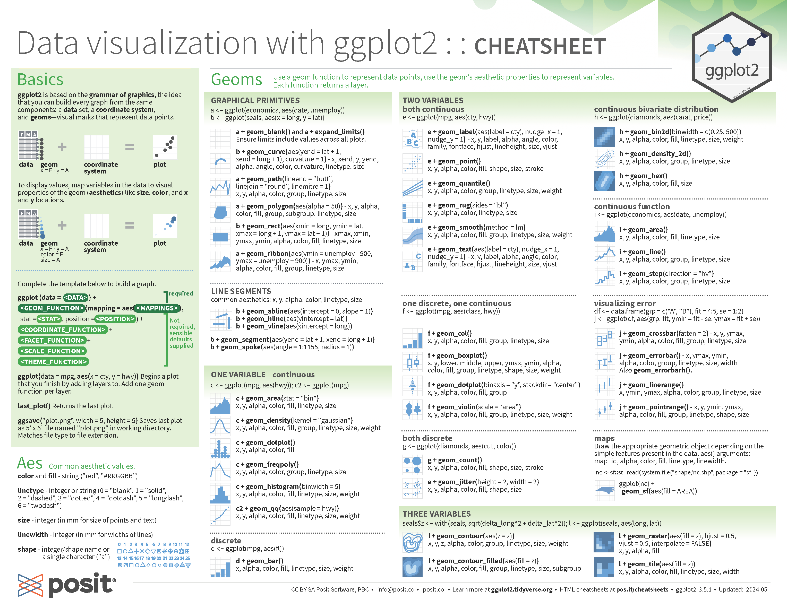
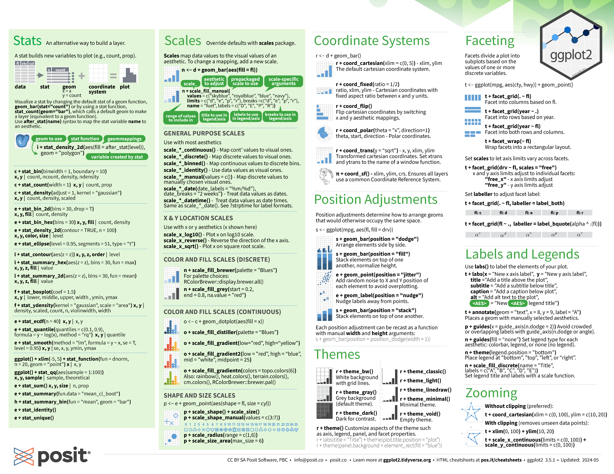

```{r setup, include=FALSE}
knitr::opts_chunk$set(echo = TRUE)
```

## Installing R

You can download R from the: [The Comprehensive R Archive Network](https://cran.r-project.org/).

Be sure to select the appropriate download link for your operating system. 


If you are using Windows, click **Download R for Windows**, then select **base** or **install R for the first time** to proceed with the installation.



Finally, click **Download** to start the installation. 

## Installing RStudio

After installing R, download RStudio from the following link: [RStudio Desktop](https://posit.co/download/rstudio-desktop/).

Click **DOWNLOAD RSTUDIO DESKTOP FOR WINDOWS**, or select the appropriate version from the list based on your operating system.

 

## Commonly Used Packages
### [**Tidyverse**](https://www.tidyverse.org/)

The Tidyverse is **a collection of essential R packages** designed for data analysis, visualization, and manipulation. It provides a consistent and efficient workflow for working with data in R.



### [**readxl**](https://readxl.tidyverse.org/index.html)

The readxl package is used to **import Excel files** (`.xls` and `.xlsx`) into R, allowing for easy data extraction and manipulation.



### [**writexl**](https://cran.r-project.org/web/packages/writexl/index.html)

The writexl package is used to **export data from R to Excel** (`.xlsx`) format, providing a simple and dependency-free way to write data frames to Excel files.

### [**showtext**](https://cran.rstudio.com/web/packages/showtext/vignettes/introduction.html)

The showtext package is used to **adjust and customize fonts** in R plots. It allows you to use various fonts, including system and web fonts, to enhance the appearance of text in your figures.



### [**rstatix**](https://rpkgs.datanovia.com/rstatix/)

The rstatix package provides a simple and consistent interface for performing **basic statistical tests** in R. It includes functions for hypothesis testing, data summarization, and statistical analysis, making it easier to conduct common tests like t-tests, ANOVA, and correlation analyses.


### [**ggpubr**](https://rpkgs.datanovia.com/ggpubr/)

The ggpubr package is designed for creating publication-ready **statistical plots** in R. It extends ggplot2 with additional functions for adding statistical annotations, customizing plot themes, and improving the presentation of data visualizations.



### [**ComplexHeatmap**](https://jokergoo.github.io/ComplexHeatmap-reference/book/)

The ComplexHeatmap package is used to create both **simple and complex heatmaps** in R, as well as other high-level visualizations. It provides advanced features for customizing heatmaps and integrating multiple data layers, making it a powerful tool for visualizing complex datasets.


## Learning Resources
### 1. Reference Books

[**R for Data Science (2e)**](https://r4ds.hadley.nz/)

>This book will teach you how to do data science with R: You'll learn how to get your data into R, get it into the most useful structure, transform it and visualize.

[**R Cookbook, 2nd Edition**](https://rc2e.com/)

>This book is full of how-to recipes, each of which solves a specific problem. The recipe includes a quick introduction to the solution followed by a discussion that aims to unpack the solution and give you some insight into how it works. We know these recipes are useful and we know they work, because we use them ourselves.

[**ggplot2: Elegant Graphics for Data Analysis (3e)**](https://ggplot2-book.org/)

>While this book gives some details on the basics of ggplot2, its primary focus is explaining the Grammar of Graphics that ggplot2 uses, and describing the full details.

[**Advanced R, 2nd Edition**](https://adv-r.hadley.nz/)

>The book is designed primarily for R users who want to improve their programming skills and understanding of the language. It should also be useful for programmers coming to R from other languages, as help you to understand why R works the way it does.

### 2. Cheatsheets

R and RStudio are supported by a vibrant community dedicated to making the R language more powerful and accessible. The community has contributed a variety of well-designed cheatsheets for R, RStudio, and R packages. You can access the [base R cheat-sheet](https://iqss.github.io/dss-workshops/R/Rintro/base-r-cheat-sheet.pdf) and explore all [Posit Cheatsheets](https://posit.co/resources/cheatsheets/) for quick references and tips.


For example, you can refer to the **ggplot2 cheatsheet**, which provides a quick reference for creating various types of plots using the ggplot2 package in R. This cheat sheet covers essential functions, customization options, and common plot types.




### 3. REDNote (or Other Social Media Platforms like YouTube or Bilibili)

You can also explore resources on REDNote, which is designed for learning R in a short amount of time. While it may provide quick insights, it is generally not recommended as a primary learning resource due to its focus on speed over in-depth understanding.


## Two Examples Demonstrating the Use of Package Functions in Proteomic Data Analysis
### 1. Kolmogorov–Smirnov test
The Kolmogorov-Smirnov (K-S) test is a non-parametric statistical test used to compare two distributions and assess whether they differ significantly. It measures the maximum absolute difference between their cumulative distribution functions (CDFs).

In proteomics, the K-S test is often used to compare the physicochemical properties of two groups of proteins (e.g., the isoelectric points of upregulated vs. downregulated proteins) or to compare fold changes across different protein categories (e.g., RNA-binding vs. non RNA-binding proteins). However, challenges arise when the data is not tidy or when comparing the distributions of multiple protein groups.

For instance, in an experiment involving newly synthesized proteins, we may want to investigate the effect of inhibitors (such as Btz and 3MA) on the abundance of newly synthesized proteins across different sub-cellular compartments.

You can get access **training data 1** for this example using the following link: [training data 1](https://github.com/lfu46/Glycoproteomic-Data-Analysis-using-R-and-Python/blob/main/Chapter_1_R_Basics/training_data/training_data.csv)

Here is how you would read in the data and take a quick look at it:

```{r training data, echo = TRUE}
# import packages
packages_names <- c('tidyverse', 'readxl', 'writexl')
lapply(packages_names, require, character.only = TRUE)

# load training data 1
training_data <- read_csv(
  'training_data/training_data.csv'
)

# have a quick look at the data
head(training_data, n = 10)
```

The dataset contains 33 columns, including `Gene Name`, `Fold Change` and `GO Terms`, but the structure is inconsistent and unsuitable for further analysis. To prepare the data for statistical tests, we need to reshape it into a [tidy format](https://r4ds.hadley.nz/data-tidy.html#sec-tidy-data), where each variable is stored in its own column and each observation is a row. This allows us to apply various data manipulation and statistical functions effectively.

In this case, we'll reshape the data and clean up the column names (especially removing slashes in `Btz/DMSO`, `3MA/DMSO` and `Comb/DMSO`).

```{r adjusted training data, echo = TRUE}
training_data_adj <- training_data |> 
  select(Gene, `Btz/DMSO`:`vacuole [GO:0005773]`) |> 
  pivot_longer(cols = `plasma membrane [GO:0005886]`:`vacuole [GO:0005773]`, names_to = 'GO_Term', values_to = 'value') |>
  filter(value == 1) |> 
  select(Gene, Btz_DMSO = `Btz/DMSO`, `3MA_DMSO` = `3MA/DMSO`, Comb_DMSO = `Comb/DMSO`, GO_Term) |> 
  pivot_longer(cols = Btz_DMSO:Comb_DMSO, names_to = 'Exp', values_to = 'Fold_Change')

# let us look at the adjusted data
head(training_data_adj, n = 10)
```

The adjusted data looks much better in a tidy way. Now we can define a function to perform the Kolmogorov-Smirnov (K-S) test for each sub-cellular compartment (i.e., for each GO term). The function will compare the fold changes across the three conditions (`Btz_DMSO`, `3MA_DMSO`, and `Comb_DMSO`).

```{r function definition, echo = TRUE}
ks_test_function <- function(df){
  # get all possible combination of experimental conditions
  Exp_list <- unique(df$Exp)
  combs <- data.frame(combn(Exp_list, 2, simplify = TRUE))
  
  # generate result tibble
  tibble(
    GO_term_list = unique(df$GO_Term),
    comparison = map(combs, \(x) paste(x, collapse = " vs ")),
    p_value = map(combs, \(x) ks.test(
      df |> filter(Exp == x[1]) |> pull(Fold_Change),
      df |> filter(Exp == x[2]) |> pull(Fold_Change)
        )$p.value
      )
    )
}
```

Then we can apply the function to our data.

```{r ks.test}
comparison_p_value_df <- training_data_adj |> 
  group_by(GO_Term) |> 
  group_split() |> 
  # map_df applies the ks_test_function to each data frame in the list generated by group_split()
  map_df(ks_test_function) |> 
  unnest_longer(c(comparison, p_value))

# let us check the result
head(comparison_p_value_df, n = 20)
```

The results are well-organized and logical, with one column for `GO terms`, one for `comparisons`, and another for `p-values` from the KS test. We can visualize these results in a heatmap to better interpret the statistical differences between conditions across the various GO terms.

```{r training data heatmap}
# import ComplexHeatmap
library(ComplexHeatmap)

# change the format of our data
heatmap_comparison_p_value <- comparison_p_value_df |> 
  mutate(log_p_value = -log10(p_value)) |> 
  select(GO_term_list, comparison, log_p_value) |> 
  pivot_wider(names_from = comparison, values_from = log_p_value)

# check
head(heatmap_comparison_p_value, n = 10)

# generate data matrix
heatmap_matrix <- data.matrix(heatmap_comparison_p_value |> select(!GO_term_list))
rownames(heatmap_matrix) <- heatmap_comparison_p_value$GO_term_list

# check
heatmap_matrix

# plot the heatmap
Heatmap(heatmap_matrix, name = '-log10_p_value', color = heatmap_color)

```

The figure may not look optimal because we haven't fine-tuned the parameters. You can find all available parameters in the [ComplexHeatmap Complete Reference](https://jokergoo.github.io/ComplexHeatmap-reference/book/). However, our focus now is on: What insights can we gain from this heatmap?

### 2. Violin boxplot
Next, we will use the data from `cytosol [GO:0005829]` to create a violin plot with boxplot overlays. 

```{r violin boxplot, echo = TRUE}
#import packages
packages_names <- c('showtext', 'rstatix', 'ggpubr')
lapply(packages_names, require, character.only = TRUE)

# statistical test
cytosol_wilcox_test <- training_data_adj |> 
  filter(GO_Term == 'cytosol [GO:0005829]') |> 
  # The Wilcoxon test is performed to compare the Fold Change between different
  # experimental conditions (Exp) with Benjamini-Hochberg correction.
  wilcox_test(Fold_Change ~ Exp, p.adjust.method = 'BH')

# check
cytosol_wilcox_test

# violin boxplot
# The showtext package is used to load and use the Arial font (or any custom font). This ensures the font is displayed correctly in the plot.
font_add(family = 'arial', regular = 'arial.ttf')
# showtext_auto() enables the automatic use of this font in the plot rendering.
showtext_auto()

violin_boxplot_cytosol <- training_data_adj |> 
  filter(GO_Term == 'cytosol [GO:0005829]') |> 
  ggplot() +
  geom_violin(
    aes(x = Exp, y = Fold_Change), fill = '#4b1978', color = 'transparent'
  ) +
  geom_boxplot(
    aes(x = Exp, y = Fold_Change), width = 0.2, outliers = FALSE
  ) +
  # stat_pvalue_manual() overlays the p-value results from the Wilcoxon test on the plot, indicating
  # statistical significance between the experimental conditions.
  stat_pvalue_manual(
    data = cytosol_wilcox_test, label = 'p.adj.signif', hide.ns = TRUE,
    tip.length = 0, y.position = c(1.8), label.size = 6
  ) +
  coord_cartesian(ylim = c(0, 2)) +
  labs(x = '', y = 'Fold Change') +
  # theme_bw() applies a clean black-and-white theme to the plot.
  theme_bw() +
  # theme() customizes various plot elements, such as grid lines and axis text properties 
  # (color, size, and angle of x-axis labels).
  theme(
    panel.grid.major = element_line(color = 'gray', linewidth = 0.2),
    panel.grid.minor = element_line(color = 'gray', linewidth = 0.1),
    axis.text.x = element_text(color = 'black', size = 9, angle = 30, hjust = 1),
    axis.text.y = element_text(color = 'black', size = 9)
  )

# display the plot
violin_boxplot_cytosol

# save the plot as an EPS file
# ggsave(
#   filename = "violin_boxplot_cytosol.eps",
#   device = 'eps',
#   height = 2, width = 2, units = 'in'
# )
```

### What have we learned
- How to reshape data from external sources (such as search engines or online tools) into a format suitable for statistical analysis and figure generation.
- How to use `ggplot2` to create a violin boxplot, fine-tune the plot with specific functions, and save the final figure in EPS format for publication or further use.

```{r session info}
sessionInfo()
```
