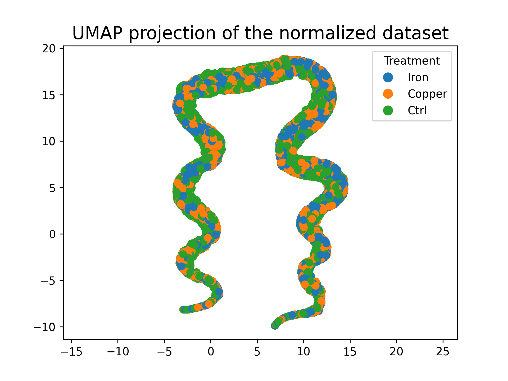

Chapter 2: Data Normalization
================
Longping Fu
03/05/2025

``` r
# import packages
library(tidyverse)
```

    ## Warning: package 'purrr' was built under R version 4.4.1

    ## Warning: package 'lubridate' was built under R version 4.4.1

    ## ── Attaching core tidyverse packages ──────────────────────── tidyverse 2.0.0 ──
    ## ✔ dplyr     1.1.4     ✔ readr     2.1.5
    ## ✔ forcats   1.0.0     ✔ stringr   1.5.1
    ## ✔ ggplot2   3.5.1     ✔ tibble    3.2.1
    ## ✔ lubridate 1.9.4     ✔ tidyr     1.3.1
    ## ✔ purrr     1.0.4     
    ## ── Conflicts ────────────────────────────────────────── tidyverse_conflicts() ──
    ## ✖ dplyr::filter() masks stats::filter()
    ## ✖ dplyr::lag()    masks stats::lag()
    ## ℹ Use the conflicted package (<http://conflicted.r-lib.org/>) to force all conflicts to become errors

``` r
# load the peptides result from searching software
peptide_result_raw <- read_csv(
  # the csv file is too large to be uploaded to github
  # change the path to your result files
  'training_data/ronghuwulab_1741203378.csv',
  col_names = TRUE,
  name_repair = 'universal'
)
```

    ## New names:
    ## Rows: 119682 Columns: 105
    ## ── Column specification
    ## ──────────────────────────────────────────────────────── Delimiter: "," chr
    ## (14): Obs.m.z.Link, SrchName, ..Ions, ..Ions.Link, Reference, Reference.... dbl
    ## (91): ScanF, Obs.m.z, z, SrchID, RunID, ScansID, PPM, Dalton, XCorr, ..9...
    ## ℹ Use `spec()` to retrieve the full column specification for this data. ℹ
    ## Specify the column types or set `show_col_types = FALSE` to quiet this message.
    ## • `Obs m/z` -> `Obs.m.z`
    ## • `Obs m/z Link` -> `Obs.m.z.Link`
    ## • `&#916;Corr` -> `..916.Corr`
    ## • `# Ions` -> `..Ions`
    ## • `# Ions Link` -> `..Ions.Link`
    ## • `Reference Link` -> `Reference.Link`
    ## • `Redun Link` -> `Redun.Link`
    ## • `Peptide Link` -> `Peptide.Link`
    ## • `Trimmed Peptide` -> `Trimmed.Peptide`
    ## • `Pept. Length` -> `Pept..Length`
    ## • `Start Position` -> `Start.Position`
    ## • `End Position` -> `End.Position`
    ## • `Gene Symbol` -> `Gene.Symbol`
    ## • `Protein MWT(kDa)` -> `Protein.MWT.kDa.`
    ## • `127nto126` -> `..127nto126`
    ## • `127nto126 Link` -> `..127nto126.Link`
    ## • `131cto126` -> `..131cto126`
    ## • `127cto126` -> `..127cto126`
    ## • `128nto126` -> `..128nto126`
    ## • `128cto126` -> `..128cto126`
    ## • `129nto126` -> `..129nto126`
    ## • `129cto126` -> `..129cto126`
    ## • `130nto126` -> `..130nto126`
    ## • `130cto126` -> `..130cto126`
    ## • `131to126` -> `..131to126`
    ## • `126 Adjusted Intensity` -> `..126.Adjusted.Intensity`
    ## • `127n Adjusted Intensity` -> `..127n.Adjusted.Intensity`
    ## • `127c Adjusted Intensity` -> `..127c.Adjusted.Intensity`
    ## • `128n Adjusted Intensity` -> `..128n.Adjusted.Intensity`
    ## • `128c Adjusted Intensity` -> `..128c.Adjusted.Intensity`
    ## • `129n Adjusted Intensity` -> `..129n.Adjusted.Intensity`
    ## • `129c Adjusted Intensity` -> `..129c.Adjusted.Intensity`
    ## • `130n Adjusted Intensity` -> `..130n.Adjusted.Intensity`
    ## • `130c Adjusted Intensity` -> `..130c.Adjusted.Intensity`
    ## • `131 Adjusted Intensity` -> `..131.Adjusted.Intensity`
    ## • `126 Sn` -> `..126.Sn`
    ## • `127n Sn` -> `..127n.Sn`
    ## • `127c Sn` -> `..127c.Sn`
    ## • `128n Sn` -> `..128n.Sn`
    ## • `128c Sn` -> `..128c.Sn`
    ## • `129n Sn` -> `..129n.Sn`
    ## • `129c Sn` -> `..129c.Sn`
    ## • `130n Sn` -> `..130n.Sn`
    ## • `130c Sn` -> `..130c.Sn`
    ## • `131 Sn` -> `..131.Sn`
    ## • `126 Raw Intensity` -> `..126.Raw.Intensity`
    ## • `127n Raw Intensity` -> `..127n.Raw.Intensity`
    ## • `127c Raw Intensity` -> `..127c.Raw.Intensity`
    ## • `128n Raw Intensity` -> `..128n.Raw.Intensity`
    ## • `128c Raw Intensity` -> `..128c.Raw.Intensity`
    ## • `129n Raw Intensity` -> `..129n.Raw.Intensity`
    ## • `129c Raw Intensity` -> `..129c.Raw.Intensity`
    ## • `130n Raw Intensity` -> `..130n.Raw.Intensity`
    ## • `130c Raw Intensity` -> `..130c.Raw.Intensity`
    ## • `131 Raw Intensity` -> `..131.Raw.Intensity`
    ## • `126 Noise` -> `..126.Noise`
    ## • `127n Noise` -> `..127n.Noise`
    ## • `127c Noise` -> `..127c.Noise`
    ## • `128n Noise` -> `..128n.Noise`
    ## • `128c Noise` -> `..128c.Noise`
    ## • `129n Noise` -> `..129n.Noise`
    ## • `129c Noise` -> `..129c.Noise`
    ## • `130n Noise` -> `..130n.Noise`
    ## • `130c Noise` -> `..130c.Noise`
    ## • `131 Noise` -> `..131.Noise`
    ## • `126 Mz Error` -> `..126.Mz.Error`
    ## • `127n Mz Error` -> `..127n.Mz.Error`
    ## • `127c Mz Error` -> `..127c.Mz.Error`
    ## • `128n Mz Error` -> `..128n.Mz.Error`
    ## • `128c Mz Error` -> `..128c.Mz.Error`
    ## • `129n Mz Error` -> `..129n.Mz.Error`
    ## • `129c Mz Error` -> `..129c.Mz.Error`
    ## • `130n Mz Error` -> `..130n.Mz.Error`
    ## • `130c Mz Error` -> `..130c.Mz.Error`
    ## • `131 Mz Error` -> `..131.Mz.Error`
    ## • `Sum Sn` -> `Sum.Sn`
    ## • `Ion Injection Time` -> `Ion.Injection.Time`
    ## • `Ms2 Ion Inj Time` -> `Ms2.Ion.Inj.Time`
    ## • `Elapsed Scan Time` -> `Elapsed.Scan.Time`
    ## • `Precursor Intensity` -> `Precursor.Intensity`
    ## • `Precursor Max Intensity` -> `Precursor.Max.Intensity`
    ## • `Precursor Max Sn` -> `Precursor.Max.Sn`
    ## • `Isolation Mz` -> `Isolation.Mz`
    ## • `Isolation Specificity` -> `Isolation.Specificity`
    ## • `Time To Max` -> `Time.To.Max`
    ## • `Difference Max Intensity` -> `Difference.Max.Intensity`
    ## • `Peak Width` -> `Peak.Width`
    ## • `Num Precursor Peaks` -> `Num.Precursor.Peaks`

``` r
peptide_result_raw_no_decoy_contaminants <- peptide_result_raw |> 
  # only keep the psm from human proteome
  filter(str_detect(Reference, 'HUMAN')) |> 
  # remove contaminant
  filter(!str_detect(Reference, 'contaminant')) |> 
  # remove decoy
  filter(!str_detect(Reference, '##')) |> 
  # remove low quality PSMs
  # for Sequest, XCorr and PPM are used
  # for other searching software, please use corresponding searching score
  # for example, Hyperscore in MSFragger
  filter(XCorr > 1.2) |> 
  filter(PPM > -10, PPM < 10) |> 
  filter(Sum.Sn > 45) |> 
  separate(Reference, into = c('sp', 'UniProt_Accession', 'protein_name'), sep = '\\|') |> 
  select(
    # keep the columns which are useful in the following data analysis
    Peptide,
    Trimmed.Peptide, 
    Pept.Length = Pept..Length, 
    Start.Position, 
    End.Position, 
    Trypticity, 
    MissedCleav,
    Obs.m.z, 
    XCorr, 
    PPM, 
    UniProt_Accession, 
    Gene.Symbol, 
    Annotation, 
    # rename the TMT channel base on your experimental design
    Iron_1 = ..126.Sn, Iron_2 = ..127n.Sn, Iron_3 = ..127c.Sn,
    Copper_4 = ..128n.Sn, Copper_5 = ..128c.Sn, Copper_6 = ..129n.Sn,
    Ctrl_7 = ..129c.Sn, Ctrl_8 = ..130n.Sn, Ctrl_9 = ..130c.Sn, 
    Sum.Sn
  )
```

``` r
# quantification on protein level
protein_quantification <- peptide_result_raw_no_decoy_contaminants |> 
  group_by(
    UniProt_Accession, Gene.Symbol, Annotation
  ) |> 
  summarise(
    Iron_1 = sum(Iron_1),
    Iron_2 = sum(Iron_2),
    Iron_3 = sum(Iron_3),
    Copper_4 = sum(Copper_4),
    Copper_5 = sum(Copper_5),
    Copper_6 = sum(Copper_6),
    Ctrl_7 = sum(Ctrl_7),
    Ctrl_8 = sum(Ctrl_8),
    Ctrl_9 = sum(Ctrl_9)
  ) |> 
  ungroup()
```

    ## `summarise()` has grouped output by 'UniProt_Accession', 'Gene.Symbol'. You can
    ## override using the `.groups` argument.

``` r
# check the sum of each TMT channel
colSums(
  protein_quantification |> select(Iron_1:Ctrl_9)
)
```

    ##   Iron_1   Iron_2   Iron_3 Copper_4 Copper_5 Copper_6   Ctrl_7   Ctrl_8 
    ## 49494037 34450910 42939901 40187880 32316432 37936857 49340660 27321462 
    ##   Ctrl_9 
    ## 24539529

``` r
# sample loading normalization
target_mean_protein <- mean(colSums(protein_quantification |> select(Iron_1:Ctrl_9)))
norm_facs_protein <- target_mean_protein/colSums(protein_quantification |> select(Iron_1:Ctrl_9))
protein_sl <- tibble(
  sweep(
    protein_quantification |> select(Iron_1:Ctrl_9), 
    2, 
    norm_facs_protein, 
    FUN = '*'
  )
)
colnames(protein_sl) <- c(
  'Iron_1_sl', 'Iron_2_sl', 'Iron_3_sl', 
  'Copper_4_sl', 'Copper_5_sl', 'Copper_6_sl',
  'Ctrl_7_sl', 'Ctrl_8_sl', 'Ctrl_9_sl'
)
protein_quantification_raw_sl <- bind_cols(protein_quantification, protein_sl)
```

``` r
# check the sum of each TMT channel
colSums(
  protein_quantification_raw_sl |> select(Iron_1_sl:Ctrl_9_sl)
)
```

    ##   Iron_1_sl   Iron_2_sl   Iron_3_sl Copper_4_sl Copper_5_sl Copper_6_sl 
    ##    37614186    37614186    37614186    37614186    37614186    37614186 
    ##   Ctrl_7_sl   Ctrl_8_sl   Ctrl_9_sl 
    ##    37614186    37614186    37614186

``` r
# TMM normalization
library(edgeR)
```

    ## Warning: package 'edgeR' was built under R version 4.4.2

    ## Loading required package: limma

    ## Warning: package 'limma' was built under R version 4.4.2

``` r
norm_facs_protein_sl_tmm <- calcNormFactors(protein_quantification_raw_sl |> select(Iron_1_sl:Ctrl_9_sl))
protein_tmm <- tibble(
  sweep(
    protein_quantification_raw_sl |> select(Iron_1_sl:Ctrl_9_sl), 
    2, 
    norm_facs_protein_sl_tmm, 
    FUN = "/"
  )
)
colnames(protein_tmm) <- c(
  'Iron_1_sl_tmm', 'Iron_2_sl_tmm', 'Iron_3_sl_tmm', 
  'Copper_4_sl_tmm', 'Copper_5_sl_tmm', 'Copper_6_sl_tmm',
  'Ctrl_7_sl_tmm', 'Ctrl_8_sl_tmm', 'Ctrl_9_sl_tmm'
)
protein_quantification_raw_sl_tmm <- bind_cols(protein_quantification_raw_sl, protein_tmm)

write_csv(
  protein_quantification_raw_sl_tmm,
  file = 'training_data/protein_quantification_raw_sl_tmm.csv'
)
```

``` r
# check the distribution of the intensity of each channel
protein_quantification_raw_sl_tmm |> 
  select(Iron_1_sl_tmm:Ctrl_9_sl_tmm) |> 
  pivot_longer(cols = Iron_1_sl_tmm:Ctrl_9_sl_tmm, names_to = 'Exp', values_to = 'Intensity') |> 
  mutate(
    log2_intensity = log2(Intensity)
  ) |> 
  ggplot() +
  geom_boxplot(
    aes(
      x = Exp,
      y = log2_intensity
    )
  ) +
  labs(x = '', y = 'log2 intensity') +
  theme(
    axis.text.x = element_text(angle = 30, hjust = 1)
  )
```

<!-- -->

``` r
# import packages
library(tidyverse)
# for executing python script in R
library(reticulate)
```

    ## Warning: package 'reticulate' was built under R version 4.4.1

``` r
# load normalized data
protein_quantification_raw_sl_tmm_data <- read_csv(
  'training_data/protein_quantification_raw_sl_tmm.csv'
) |> 
  select(UniProt_Accession, Iron_1_sl_tmm:Ctrl_9_sl_tmm) |> 
  pivot_longer(cols = Iron_1_sl_tmm:Ctrl_9_sl_tmm, names_to = 'Treatment', values_to = 'Intensity') |> 
  mutate(
    Treatment = case_when(
      str_detect(Treatment, 'Iron') ~ 'Iron',
      str_detect(Treatment, 'Copper') ~ 'Copper',
      str_detect(Treatment, 'Ctrl') ~ 'Ctrl'
    ),
    Exp = rep(c('Exp_1', 'Exp_2', 'Exp_3'), 21321)
  ) |> 
  pivot_wider(
    names_from = Exp, values_from = Intensity
  )
```

    ## Rows: 7107 Columns: 30
    ## ── Column specification ────────────────────────────────────────────────────────
    ## Delimiter: ","
    ## chr  (3): UniProt_Accession, Gene.Symbol, Annotation
    ## dbl (27): Iron_1, Iron_2, Iron_3, Copper_4, Copper_5, Copper_6, Ctrl_7, Ctrl...
    ## 
    ## ℹ Use `spec()` to retrieve the full column specification for this data.
    ## ℹ Specify the column types or set `show_col_types = FALSE` to quiet this message.

``` r
write_csv(
  protein_quantification_raw_sl_tmm_data,
  file = 'training_data/protein_quantification_raw_sl_tmm_data.csv'
)

# use specific virtual env
use_condaenv(
  condaenv = '/opt/anaconda3/envs/UMAP_env',
  required = TRUE
)

# execute the python script for UMAP_preparation
source_python("UMAP.py")
```



``` r
sessionInfo()
```

    ## R version 4.4.0 (2024-04-24)
    ## Platform: aarch64-apple-darwin20
    ## Running under: macOS Sonoma 14.6.1
    ## 
    ## Matrix products: default
    ## BLAS:   /Library/Frameworks/R.framework/Versions/4.4-arm64/Resources/lib/libRblas.0.dylib 
    ## LAPACK: /Library/Frameworks/R.framework/Versions/4.4-arm64/Resources/lib/libRlapack.dylib;  LAPACK version 3.12.0
    ## 
    ## locale:
    ## [1] en_US.UTF-8/en_US.UTF-8/en_US.UTF-8/C/en_US.UTF-8/en_US.UTF-8
    ## 
    ## time zone: America/New_York
    ## tzcode source: internal
    ## 
    ## attached base packages:
    ## [1] stats     graphics  grDevices utils     datasets  methods   base     
    ## 
    ## other attached packages:
    ##  [1] reticulate_1.40.0 edgeR_4.4.2       limma_3.62.2      lubridate_1.9.4  
    ##  [5] forcats_1.0.0     stringr_1.5.1     dplyr_1.1.4       purrr_1.0.4      
    ##  [9] readr_2.1.5       tidyr_1.3.1       tibble_3.2.1      ggplot2_3.5.1    
    ## [13] tidyverse_2.0.0  
    ## 
    ## loaded via a namespace (and not attached):
    ##  [1] generics_0.1.3    stringi_1.8.4     lattice_0.22-6    hms_1.1.3        
    ##  [5] digest_0.6.37     magrittr_2.0.3    evaluate_1.0.3    grid_4.4.0       
    ##  [9] timechange_0.3.0  fastmap_1.2.0     jsonlite_1.8.9    Matrix_1.7-2     
    ## [13] scales_1.3.0      cli_3.6.4         rlang_1.1.5       crayon_1.5.3     
    ## [17] bit64_4.6.0-1     munsell_0.5.1     withr_3.0.2       yaml_2.3.10      
    ## [21] tools_4.4.0       parallel_4.4.0    tzdb_0.4.0        colorspace_2.1-1 
    ## [25] locfit_1.5-9.11   png_0.1-8         vctrs_0.6.5       R6_2.6.1         
    ## [29] lifecycle_1.0.4   bit_4.5.0.1       vroom_1.6.5       pkgconfig_2.0.3  
    ## [33] pillar_1.10.1     gtable_0.3.6      Rcpp_1.0.14       glue_1.8.0       
    ## [37] statmod_1.5.0     xfun_0.50         tidyselect_1.2.1  rstudioapi_0.17.1
    ## [41] knitr_1.49        farver_2.1.2      htmltools_0.5.8.1 rmarkdown_2.29   
    ## [45] labeling_0.4.3    compiler_4.4.0
